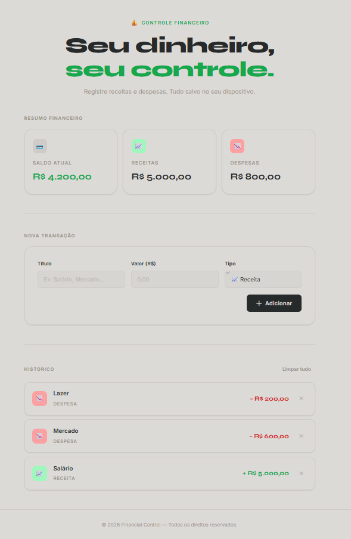

# Financial Control 💰

Uma aplicação web para gerenciamento financeiro pessoal desenvolvida com HTML, CSS e JavaScript puro.

O projeto permite registrar receitas e despesas, acompanhar o saldo em tempo real e visualizar o histórico de transações através de uma interface moderna e responsiva.

Além das funcionalidades de controle financeiro, a aplicação conta com animações, notificações visuais e armazenamento local dos dados para proporcionar uma experiência mais agradável ao usuário.

## Preview



---

## Funcionalidades

* Cadastro de receitas e despesas
* Atualização automática do saldo
* Cálculo total de receitas
* Cálculo total de despesas
* Histórico completo de transações
* Remoção individual de transações
* Limpeza completa do histórico
* Validação de campos obrigatórios
* Persistência de dados utilizando LocalStorage
* Notificações visuais (Toast Messages)
* Animações de entrada com Intersection Observer
* Efeito visual de chuva de símbolos financeiros utilizando Canvas API
* Layout totalmente responsivo

---

## Tecnologias Utilizadas

### Front-End

* HTML5
* CSS3
* JavaScript (ES6+)

### APIs e Recursos Nativos

* LocalStorage API
* Canvas API
* Intersection Observer API

### Tipografia

* Inter
* Syne

---

## Estrutura do Projeto

```text
Financial-Control/
│
├── index.html
│
├── css/
│   ├── style.css
│   └── assets/
│
├── js/
│   └── script.js
│
└── README.md
```

---

## Como Executar

1. Clone o repositório:

```bash
git clone https://github.com/rafael-correa-silva/financial-control.git
```

2. Abra o projeto:

```bash
cd financial-control
```

3. Execute o arquivo:

```text
index.html
```

ou utilize a extensão Live Server no Visual Studio Code.

---

## Conceitos Aplicados

Durante o desenvolvimento deste projeto foram aplicados conceitos importantes de JavaScript, incluindo:

* Manipulação do DOM
* Eventos
* Arrays
* Objetos
* Funções
* Arrow Functions
* LocalStorage
* Programação orientada a componentes visuais
* Formatação de valores monetários
* Criação dinâmica de elementos HTML
* Validação de formulários

---

## Possíveis Melhorias Futuras

* Filtros por categoria
* Pesquisa de transações
* Gráficos financeiros
* Exportação para PDF
* Exportação para Excel
* Categorias personalizadas
* Tema escuro
* Integração com banco de dados
* Sistema de login

---

## Autor

Desenvolvido por Rafael como projeto de estudo e prática de desenvolvimento Front-End.


